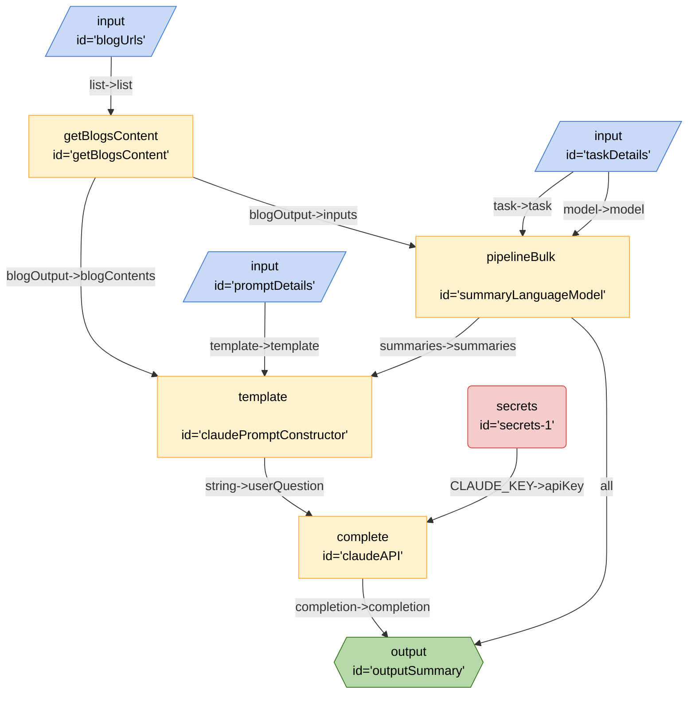

# Course Crafter Kit Bulk Blogs Test

## Mermaid

```

## JSON
```json
{
	"title": "Course Crafter Kit Bulk Blogs Test",
	"description": "Course Crafter Kit Bulk Blogs Testt",
	"version": "0.0.1",
	"edges": [
		{
			"from": "blogUrls",
			"to": "getBlogsContent",
			"out": "list",
			"in": "list"
		},
		{
			"from": "taskDetails",
			"to": "summaryLanguageModel",
			"out": "model",
			"in": "model"
		},
		{
			"from": "taskDetails",
			"to": "summaryLanguageModel",
			"out": "task",
			"in": "task"
		},
		{
			"from": "getBlogsContent",
			"to": "summaryLanguageModel",
			"out": "blogOutput",
			"in": "inputs"
		},
		{
			"from": "summaryLanguageModel",
			"to": "outputSummary",
			"out": "*"
		},
		{
			"from": "promptDetails",
			"to": "claudePromptConstructor",
			"out": "template",
			"in": "template"
		},
		{
			"from": "getBlogsContent",
			"to": "claudePromptConstructor",
			"out": "blogOutput",
			"in": "blogContents"
		},
		{
			"from": "summaryLanguageModel",
			"to": "claudePromptConstructor",
			"out": "summaries",
			"in": "summaries"
		},
		{
			"from": "secrets-1",
			"to": "claudeAPI",
			"out": "CLAUDE_KEY",
			"in": "apiKey"
		},
		{
			"from": "claudePromptConstructor",
			"to": "claudeAPI",
			"out": "string",
			"in": "userQuestion"
		},
		{
			"from": "claudeAPI",
			"to": "outputSummary",
			"out": "completion",
			"in": "completion"
		}
	],
	"nodes": [
		{
			"id": "blogUrls",
			"type": "input",
			"configuration": {
				"schema": {
					"type": "object",
					"properties": {
						"text": {
							"type": "list",
							"title": "Text",
							"description": "urls"
						}
					}
				}
			}
		},
		{
			"id": "taskDetails",
			"type": "input",
			"configuration": {
				"schema": {
					"type": "object",
					"properties": {
						"text": {
							"type": "string",
							"title": "Text",
							"description": "urls"
						}
					}
				}
			}
		},
		{
			"id": "promptDetails",
			"type": "input",
			"configuration": {
				"schema": {
					"type": "object",
					"properties": {
						"text": {
							"type": "string",
							"title": "Text",
							"description": "urls"
						}
					}
				}
			}
		},
		{
			"id": "getBlogsContent",
			"type": "getBlogsContent"
		},
		{
			"id": "outputSummary",
			"type": "output"
		},
		{
			"id": "summaryLanguageModel",
			"type": "pipelineBulk"
		},
		{
			"id": "claudePromptConstructor",
			"type": "template",
			"configuration": {
				"template": "Based these summaries of blog posts:/n{{summaries}}/nand the original text: /n{{blogContents}}/ncan you outline topics discussed in each blog? For each blog give me code sample on how to achieve the discussed topic. Output result in markdown format, do not include the summary text in the output. Separate discussed topics in bullet points."
			}
		},
		{
			"id": "secrets-1",
			"type": "secrets",
			"configuration": {
				"keys": [
					"CLAUDE_KEY"
				]
			}
		},
		{
			"id": "claudeAPI",
			"type": "complete",
			"configuration": {
				"model": "claude-2",
				"url": "https://api.anthropic.com/v1/complete"
			}
		}
	],
	"kits": [
		{
			"url": "npm@exadev/breadboard-kits/CourseCrafter"
		},
		{
			"url": "npm:@xenova/transformers"
		},
		{
			"url": "npm:@exadev/breadboard-kits/Claude"
		},
		{
			"url": "npm:@exadev/breadboard-kits/kits/StringKit"
		},
		{
			"url": "npm:@google-labs/llm-starter"
		}
	]
}
```