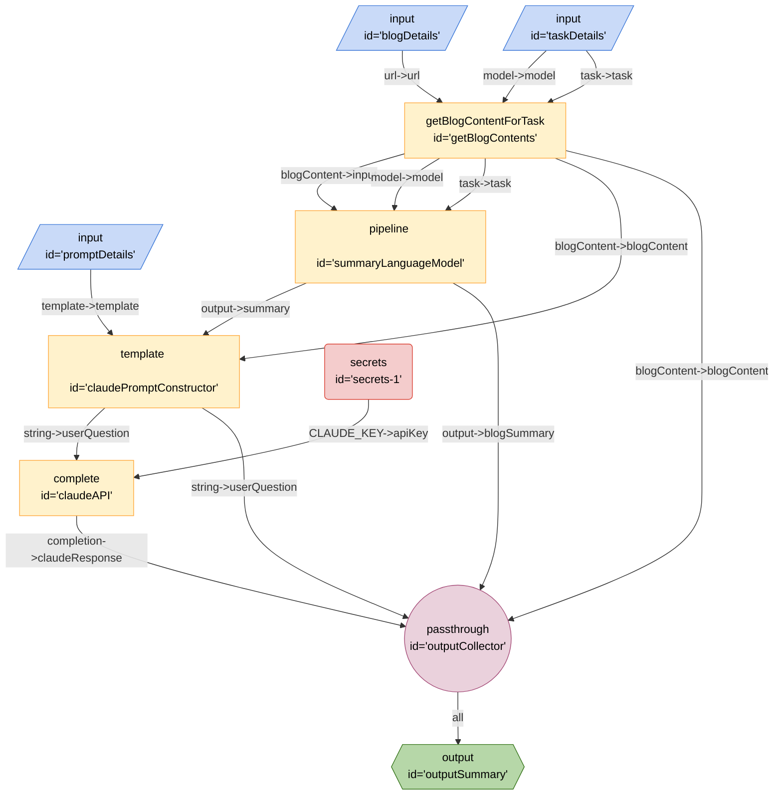

# Course Crafter Kit

## Mermaid

```

## JSON
```json
{
	"title": "Course Crafter Kit",
	"description": "Course Crafter Kit Test with Xenova",
	"version": "0.0.1",
	"edges": [
		{
			"from": "promptDetails",
			"to": "claudePromptConstructor",
			"out": "template",
			"in": "template"
		},
		{
			"from": "blogDetails",
			"to": "getBlogContents",
			"out": "url",
			"in": "url"
		},
		{
			"from": "taskDetails",
			"to": "getBlogContents",
			"out": "model",
			"in": "model"
		},
		{
			"from": "taskDetails",
			"to": "getBlogContents",
			"out": "task",
			"in": "task"
		},
		{
			"from": "getBlogContents",
			"to": "summaryLanguageModel",
			"out": "blogContent",
			"in": "input"
		},
		{
			"from": "getBlogContents",
			"to": "summaryLanguageModel",
			"out": "model",
			"in": "model"
		},
		{
			"from": "getBlogContents",
			"to": "summaryLanguageModel",
			"out": "task",
			"in": "task"
		},
		{
			"from": "getBlogContents",
			"to": "claudePromptConstructor",
			"out": "blogContent",
			"in": "blogContent"
		},
		{
			"from": "summaryLanguageModel",
			"to": "claudePromptConstructor",
			"out": "output",
			"in": "summary"
		},
		{
			"from": "getBlogContents",
			"to": "outputCollector",
			"out": "blogContent",
			"in": "blogContent"
		},
		{
			"from": "summaryLanguageModel",
			"to": "outputCollector",
			"out": "output",
			"in": "blogSummary"
		},
		{
			"from": "secrets-1",
			"to": "claudeAPI",
			"out": "CLAUDE_KEY",
			"in": "apiKey"
		},
		{
			"from": "claudePromptConstructor",
			"to": "claudeAPI",
			"out": "string",
			"in": "userQuestion"
		},
		{
			"from": "claudePromptConstructor",
			"to": "outputCollector",
			"out": "string",
			"in": "userQuestion"
		},
		{
			"from": "claudeAPI",
			"to": "outputCollector",
			"out": "completion",
			"in": "claudeResponse"
		},
		{
			"from": "outputCollector",
			"to": "outputSummary",
			"out": "*"
		}
	],
	"nodes": [
		{
			"id": "blogDetails",
			"type": "input",
			"configuration": {
				"schema": {
					"type": "object",
					"properties": {
						"text": {
							"type": "string",
							"title": "Text",
							"description": "urls"
						}
					}
				}
			}
		},
		{
			"id": "promptDetails",
			"type": "input",
			"configuration": {
				"schema": {
					"type": "object",
					"properties": {
						"text": {
							"type": "string",
							"title": "Text",
							"description": "urls"
						}
					}
				}
			}
		},
		{
			"id": "taskDetails",
			"type": "input",
			"configuration": {
				"schema": {
					"type": "object",
					"properties": {
						"text": {
							"type": "string",
							"title": "Text",
							"description": "model and task"
						}
					}
				}
			}
		},
		{
			"id": "getBlogContents",
			"type": "getBlogContentForTask"
		},
		{
			"id": "summaryLanguageModel",
			"type": "pipeline"
		},
		{
			"id": "outputSummary",
			"type": "output"
		},
		{
			"id": "claudePromptConstructor",
			"type": "template",
			"configuration": {
				"template": "Based on this summary and original text, give me code sample on how to achieve the discussed topic. Output result in markdown format, do not include the summary text in the output: /n{{summary}}/nthe original text is the following: /n{{blogContent}}"
			}
		},
		{
			"id": "outputCollector",
			"type": "passthrough"
		},
		{
			"id": "secrets-1",
			"type": "secrets",
			"configuration": {
				"keys": [
					"CLAUDE_KEY"
				]
			}
		},
		{
			"id": "claudeAPI",
			"type": "complete",
			"configuration": {
				"model": "claude-2",
				"url": "https://api.anthropic.com/v1/complete"
			}
		}
	],
	"kits": [
		{
			"url": "npm@exadev/breadboard-kits/CourseCrafter"
		},
		{
			"url": "npm:@xenova/transformers"
		},
		{
			"url": "npm:@exadev/breadboard-kits/Claude"
		},
		{
			"url": "npm:@exadev/breadboard-kits/kits/StringKit"
		},
		{
			"url": "npm:@google-labs/core-kit"
		},
		{
			"url": "npm:@google-labs/llm-starter"
		}
	]
}
```