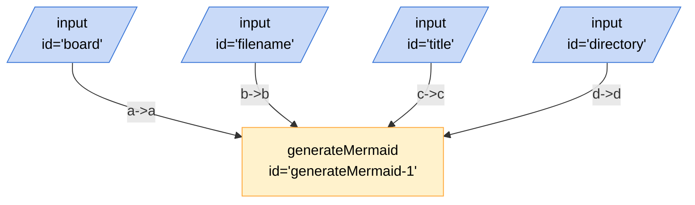

# Markdown Kit Mermaid

## Mermaid

```mermaid
%%{init: 'themeVariables': { 'fontFamily': 'Fira Code, monospace' }}%%
graph TD;
board[/"input <br> id='board'"/]:::input -- "a->a" --> generateMermaid1["generateMermaid <br> id='generateMermaid-1'"]
filename[/"input <br> id='filename'"/]:::input -- "b->b" --> generateMermaid1["generateMermaid <br> id='generateMermaid-1'"]
title[/"input <br> id='title'"/]:::input -- "c->c" --> generateMermaid1["generateMermaid <br> id='generateMermaid-1'"]
directory[/"input <br> id='directory'"/]:::input -- "d->d" --> generateMermaid1["generateMermaid <br> id='generateMermaid-1'"]
classDef default stroke:#ffab40,fill:#fff2ccff,color:#000
classDef input stroke:#3c78d8,fill:#c9daf8ff,color:#000
classDef output stroke:#38761d,fill:#b6d7a8ff,color:#000
classDef passthrough stroke:#a64d79,fill:#ead1dcff,color:#000
classDef slot stroke:#a64d79,fill:#ead1dcff,color:#000
classDef config stroke:#a64d79,fill:#ead1dcff,color:#000
classDef secrets stroke:#db4437,fill:#f4cccc,color:#000
classDef slotted stroke:#a64d79
```