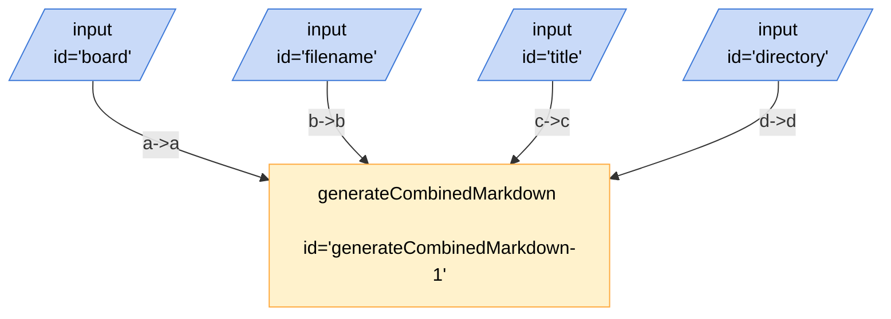

# Markdown Kit Combined

## Mermaid


## JSON
```json
{
	"title": "Markdown Kit Combined",
	"description": "Exadev Markdown Kit Combined Test",
	"version": "0.0.1",
	"edges": [
		{
			"from": "board",
			"to": "generateCombinedMarkdown-1",
			"out": "a",
			"in": "a"
		},
		{
			"from": "filename",
			"to": "generateCombinedMarkdown-1",
			"out": "b",
			"in": "b"
		},
		{
			"from": "title",
			"to": "generateCombinedMarkdown-1",
			"out": "c",
			"in": "c"
		},
		{
			"from": "directory",
			"to": "generateCombinedMarkdown-1",
			"out": "d",
			"in": "d"
		}
	],
	"nodes": [
		{
			"id": "board",
			"type": "input",
			"configuration": {
				"schema": {
					"type": "object",
					"properties": {
						"text": {
							"type": "string",
							"title": "Text",
							"description": "concat"
						}
					}
				}
			}
		},
		{
			"id": "filename",
			"type": "input",
			"configuration": {
				"schema": {
					"type": "object",
					"properties": {
						"text": {
							"type": "string",
							"title": "Text",
							"description": "concat"
						}
					}
				}
			}
		},
		{
			"id": "title",
			"type": "input",
			"configuration": {
				"schema": {
					"type": "object",
					"properties": {
						"text": {
							"type": "string",
							"title": "Text",
							"description": "concat"
						}
					}
				}
			}
		},
		{
			"id": "directory",
			"type": "input",
			"configuration": {
				"schema": {
					"type": "object",
					"properties": {
						"text": {
							"type": "string",
							"title": "Text",
							"description": "concat"
						}
					}
				}
			}
		},
		{
			"id": "generateCombinedMarkdown-1",
			"type": "generateCombinedMarkdown"
		}
	],
	"kits": [
		{
			"url": "npm:@exadev/breadboard-kits/markdownKit"
		}
	]
}
```